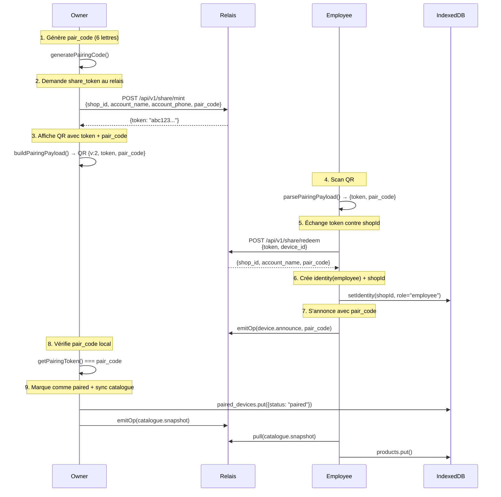
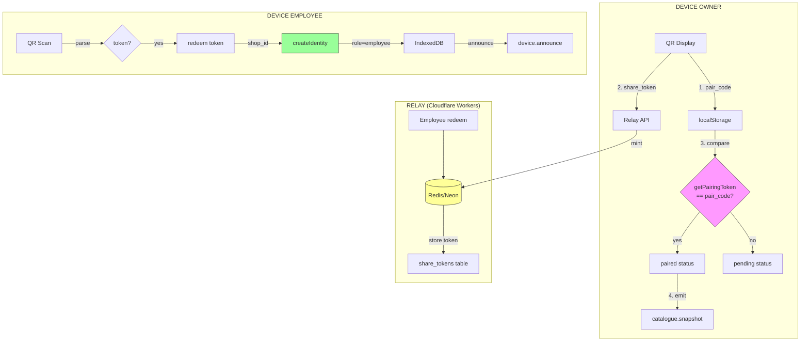

# Architecture ECAISSE v2 - Share Token Flow

## Problème résolu
- Scan QR employé créait un compte owner au lieu de employee
- Pas de partage de stock entre appareils

##Nouvelle Architecture - Share Token (QR v2)



## Architecture composants



## Schéma BDD Relais (Neon PostgreSQL - Gratuit)

```sql
-- Table des tokens de partage
CREATE TABLE share_tokens (
    id UUID PRIMARY KEY DEFAULT gen_random_uuid(),
    shop_id VARCHAR(64) NOT NULL,
    account_name VARCHAR(128),
    account_phone VARCHAR(32),
    pair_code VARCHAR(6) NOT NULL,
    token VARCHAR(64) UNIQUE NOT NULL,
    created_at TIMESTAMPTZ DEFAULT NOW(),
    expires_at TIMESTAMPTZ DEFAULT NOW() + INTERVAL '10 minutes',
    redeemed BOOLEAN DEFAULT FALSE,
    redeemed_by_device_id VARCHAR(64),
    redeemed_at TIMESTAMPTZ
);

CREATE INDEX idx_share_tokens_token ON share_tokens(token);
CREATE INDEX idx_share_tokens_shop ON share_tokens(shop_id);

-- Table des ops P2P (existante)
CREATE TABLE sync_ops (
    id VARCHAR(128) PRIMARY KEY,
    shop_id VARCHAR(64) NOT NULL,
    device_id VARCHAR(64) NOT NULL,
    seq INTEGER NOT NULL,
    type VARCHAR(64) NOT NULL,
    entity_id VARCHAR(64) NOT NULL,
    payload JSONB,
    created_at TIMESTAMPTZ DEFAULT NOW()
);

CREATE INDEX idx_sync_ops_shop ON sync_ops(shop_id, device_id);
```

## Endpoints relais

```typescript
// POST /api/v1/share/mint
// Génère un token de partage (owner only)
{
  body: {
    shop_id: string,
    account_name: string, 
    account_phone: string,
    pair_code: string  // 6 lettres
  }
}

// POST /api/v1/share/redeem
// Échange token contre shop_id (employee)
{
  body: {
    token: string,
    device_id: string
  }
}
```

## Corrections appliquées

| Bug | Solution v2 |
|-----|-------------|
| Scan crée owner | Token déclenche `role=employee` |
| Pas de stock share | Catalogue auto-sync sur paired |
| QR contient password | Plus de password, token opaque |
| Pairing non sécurisé | Code 6 lettres + token |

## Déploiement Gratuit

| Service | Quota Gratuit | Usage |
|---------|---------------|-------|
| **Neon** | 512MB, 1 projet | BDD PostgreSQL |
| **Cloudflare Workers** | 100K req/jour | API relais |
| **Vercel** | 100GB bandwidth | SPA static |

Coût total: **0€/mois** pour usage small business